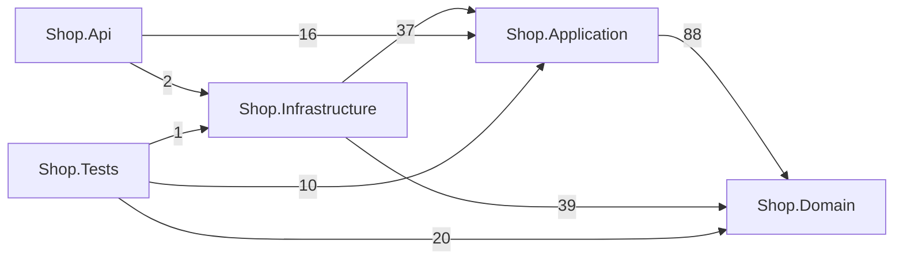
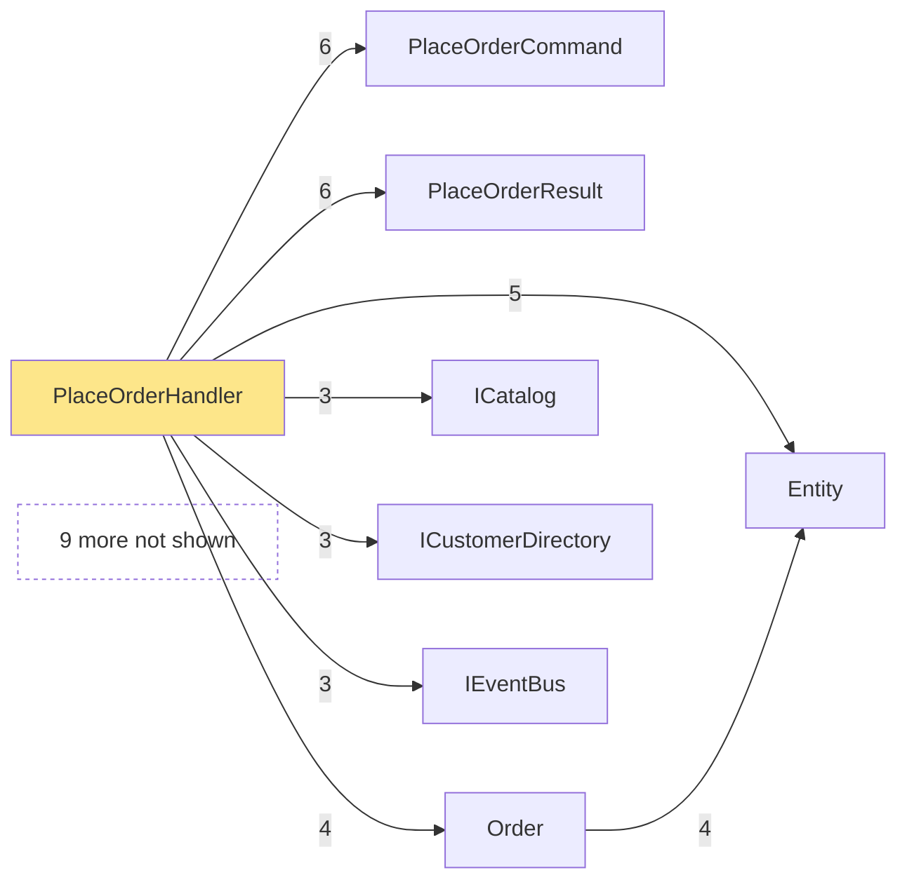
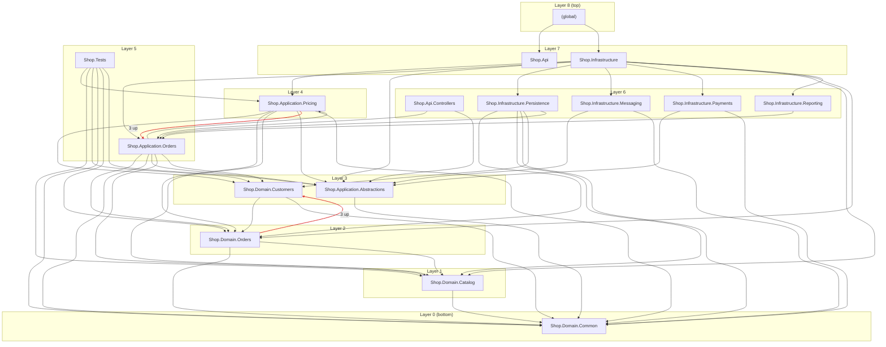
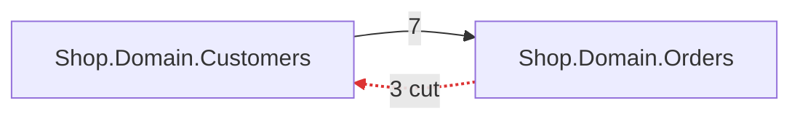
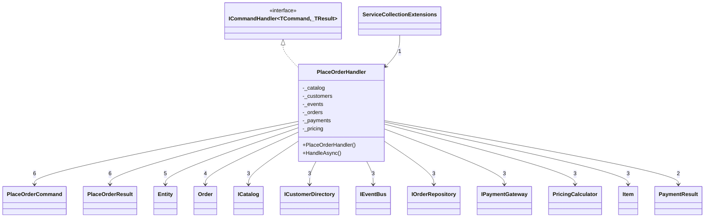
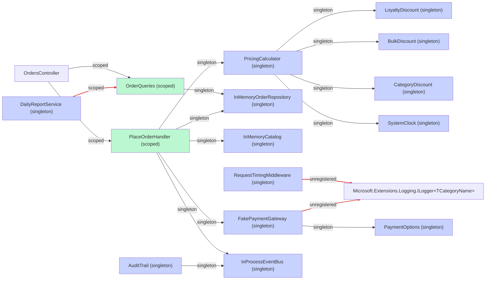

# Mermaid diagrams of samples/Shop

## Projects

```mermaid
flowchart LR
    n0["Shop.Application"]
    n1["Shop.Domain"]
    n2["Shop.Infrastructure"]
    n3["Shop.Tests"]
    n4["Shop.Api"]
    n0 -->|"88"| n1
    n2 -->|"39"| n1
    n2 -->|"37"| n0
    n3 -->|"20"| n1
    n4 -->|"16"| n0
    n3 -->|"10"| n0
    n4 -->|"2"| n2
    n3 -->|"1"| n2
```

## Around PlaceOrderHandler

```mermaid
flowchart LR
    n0["PlaceOrderHandler"]
    n1["PlaceOrderCommand"]
    n2["PlaceOrderResult"]
    n3["Entity"]
    n4["Order"]
    n5["ICatalog"]
    n6["ICustomerDirectory"]
    n7["IEventBus"]
    n0 -->|"6"| n1
    n0 -->|"6"| n2
    n0 -->|"5"| n3
    n0 -->|"4"| n4
    n4 -->|"4"| n3
    n0 -->|"3"| n7
    n0 -->|"3"| n5
    n0 -->|"3"| n6
    note["9 more not shown"]
    style note fill:none,stroke-dasharray:3 3
    classDef focus fill:#fde68a
    class n0 focus
```

## Layers of namespaces

```mermaid
flowchart TB
    subgraph layer8["Layer 8 (top)"]
        n0["(global)"]
    end
    subgraph layer7["Layer 7"]
        n1["Shop.Api"]
        n2["Shop.Infrastructure"]
    end
    subgraph layer6["Layer 6"]
        n3["Shop.Api.Controllers"]
        n4["Shop.Infrastructure.Messaging"]
        n5["Shop.Infrastructure.Payments"]
        n6["Shop.Infrastructure.Persistence"]
        n7["Shop.Infrastructure.Reporting"]
    end
    subgraph layer5["Layer 5"]
        n8["Shop.Application.Orders"]
        n9["Shop.Tests"]
    end
    subgraph layer4["Layer 4"]
        n10["Shop.Application.Pricing"]
    end
    subgraph layer3["Layer 3"]
        n11["Shop.Application.Abstractions"]
        n12["Shop.Domain.Customers"]
    end
    subgraph layer2["Layer 2"]
        n13["Shop.Domain.Orders"]
    end
    subgraph layer1["Layer 1"]
        n14["Shop.Domain.Catalog"]
    end
    subgraph layer0["Layer 0 (bottom)"]
        n15["Shop.Domain.Common"]
    end
    n10 --> n12
    n10 --> n13
    n13 --> n15
    n8 --> n13
    n3 --> n8
    n8 --> n15
    n8 --> n11
    n6 --> n13
    n6 --> n14
    n4 --> n11
    n12 --> n13
    n6 --> n15
    n2 --> n10
    n9 --> n10
    n10 --> n14
    n14 --> n15
    n13 --> n14
    n2 --> n8
    n9 --> n14
    n9 --> n12
    n8 --> n10
    n6 --> n12
    n5 --> n11
    n4 --> n15
    n12 --> n15
    n6 --> n8
    n2 --> n11
    n2 --> n6
    n9 --> n15
    n9 --> n13
    n11 --> n15
    n3 --> n11
    n10 --> n11
    n7 --> n8
    n10 -->|"3 up"| n8
    n13 -->|"3 up"| n12
    n2 --> n4
    n0 --> n1
    n5 --> n15
    n2 --> n5
    n2 --> n14
    n9 --> n11
    n0 --> n2
    n8 --> n14
    n8 --> n12
    n10 --> n15
    n2 --> n13
    n2 --> n7
    linkStyle 34,35 stroke:#d33,stroke-width:2px
```

## A namespace cycle

```mermaid
flowchart LR
    n0["Shop.Domain.Customers"]
    n1["Shop.Domain.Orders"]
    n0 -->|"7"| n1
    n1 -.->|"3 cut"| n0
    linkStyle 1 stroke:#d33,stroke-width:2px
```

## Class PlaceOrderHandler

```mermaid
classDiagram
    class C0["PlaceOrderHandler"] {
        -_catalog
        -_customers
        -_events
        -_orders
        -_payments
        -_pricing
        +PlaceOrderHandler()
        +HandleAsync()
    }
    class C1["ICommandHandler#lt;TCommand,_TResult#gt;"] {
        <<interface>>
    }
    class C2["PlaceOrderCommand"]
    class C3["PlaceOrderResult"]
    class C4["Entity"]
    class C5["Order"]
    class C6["ICatalog"]
    class C7["ICustomerDirectory"]
    class C8["IEventBus"]
    class C9["IOrderRepository"]
    class C10["IPaymentGateway"]
    class C11["PricingCalculator"]
    class C12["Item"]
    class C13["PaymentResult"]
    class C14["ServiceCollectionExtensions"]
    C1 <|.. C0
    C0 --> C2 : 6
    C0 --> C3 : 6
    C0 --> C4 : 5
    C0 --> C5 : 4
    C0 --> C6 : 3
    C0 --> C7 : 3
    C0 --> C8 : 3
    C0 --> C9 : 3
    C0 --> C10 : 3
    C0 --> C11 : 3
    C0 --> C12 : 3
    C0 --> C13 : 2
    C14 --> C0 : 1
```

## DI

```mermaid
flowchart LR
    n0["OrdersController"]
    n1["PlaceOrderHandler (scoped)"]
    n2["OrderQueries (scoped)"]
    n3["RequestTimingMiddleware (singleton)"]
    n4["Microsoft.Extensions.Logging.ILogger#lt;TCategoryName#gt;"]
    n5["InMemoryOrderRepository (singleton)"]
    n6["InMemoryCatalog (singleton)"]
    n7["PricingCalculator (singleton)"]
    n8["FakePaymentGateway (singleton)"]
    n9["InProcessEventBus (singleton)"]
    n10["LoyaltyDiscount (singleton)"]
    n11["BulkDiscount (singleton)"]
    n12["CategoryDiscount (singleton)"]
    n13["SystemClock (singleton)"]
    n14["AuditTrail (singleton)"]
    n15["PaymentOptions (singleton)"]
    n16["DailyReportService (singleton)"]
    n0 -->|"scoped"| n1
    n0 -->|"scoped"| n2
    n3 -->|"unregistered"| n4
    n2 -->|"singleton"| n5
    n1 -->|"singleton"| n5
    n1 -->|"singleton"| n6
    n1 -->|"singleton"| n7
    n1 -->|"singleton"| n8
    n1 -->|"singleton"| n9
    n7 -->|"singleton"| n10
    n7 -->|"singleton"| n11
    n7 -->|"singleton"| n12
    n7 -->|"singleton"| n13
    n14 -->|"singleton"| n9
    n8 -->|"unregistered"| n4
    n8 -->|"singleton"| n15
    n16 -->|"scoped"| n2
    linkStyle 2,14,16 stroke:#d33,stroke-width:2px
    classDef scoped fill:#bbf7d0
    class n1,n2 scoped
    classDef singleton fill:#c7d2fe
    class n3,n5,n6,n7,n8,n9,n10,n11,n12,n13,n14,n15,n16 singleton
```
